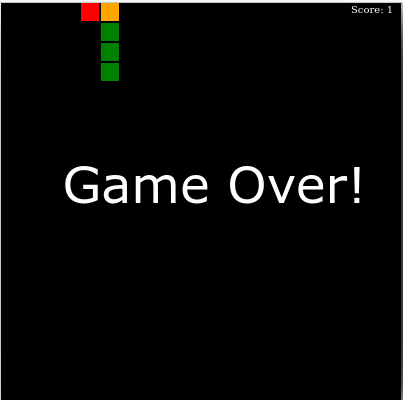

# snake-game-js

Game snake with js

Original em - https://github.com/Kamau-ke/How-to-buid-snake-game-with-javaScript
Tutorial:

https://www.section.io/engineering-education/how-to-build-a-snake-game-with-javascript/

Tem alguns pequenos problemas, mas acho que vale a pena publicar aqui:
- No Firefox a seta para a direita não funciona

## Todo
- Corrigir o evento para pressionar a ecla para a direita
- Legal seria mostrar um botão de reiniciar após o GameOver. Como não tem teclo F5

## Outros jogos aqui
- https://github.com/ribafs?tab=repositories&q=game&type=&language=&sort=
